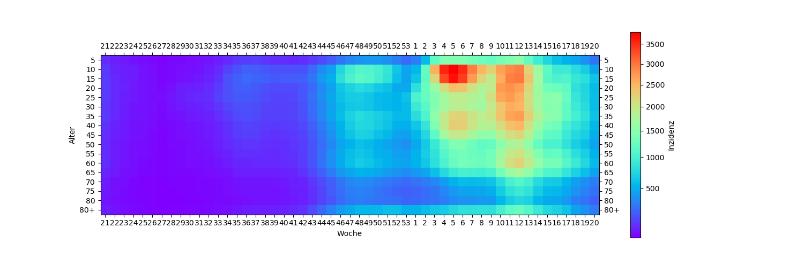

# Corona Kiel

Fetch the latest Corona numbers from Kiel and plot them by 5 year age interval

## Example:

## Data

The data is from RKI and fetched with python's selenium webdriver from  
https://survstat.rki.de/Content/Query/Create.aspx

## TODO
 * label axis
 * plot only the latest 3 months
